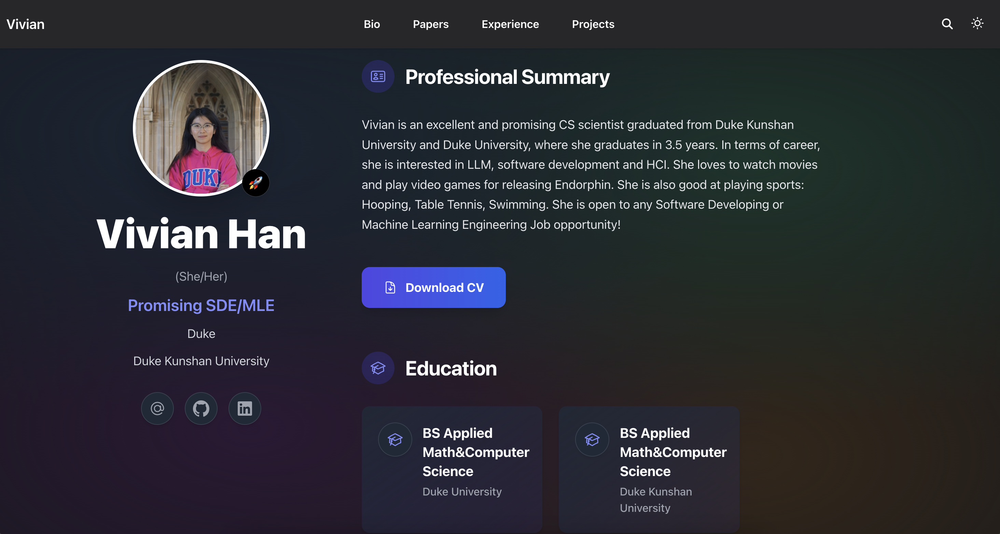

# who is Vivian?

[](https://hugoblox.com/templates/academic-cv/start/?utm_source=github&utm_medium=readme)

<h1 align="center">Build an Academic CV and Resumé That Stands Out</h1>

<p align="center">
  <strong> </strong><br/>
  Showcase your work, boost your citations, and land your dream job at places like <strong>Meta, Google, and Stanford</strong>.
</p>


### Prefer the Command Line?

Use the local quickstart:

```bash
# 1. Install Hugo Extended → https://docs.hugoblox.com/getting-started/install-hugo/
# 2. Clone this starter
git clone https://github.com/HugoBlox/theme-academic-cv my-site
cd my-site

# 3. Run locally
pnpm install && hugo server
```


