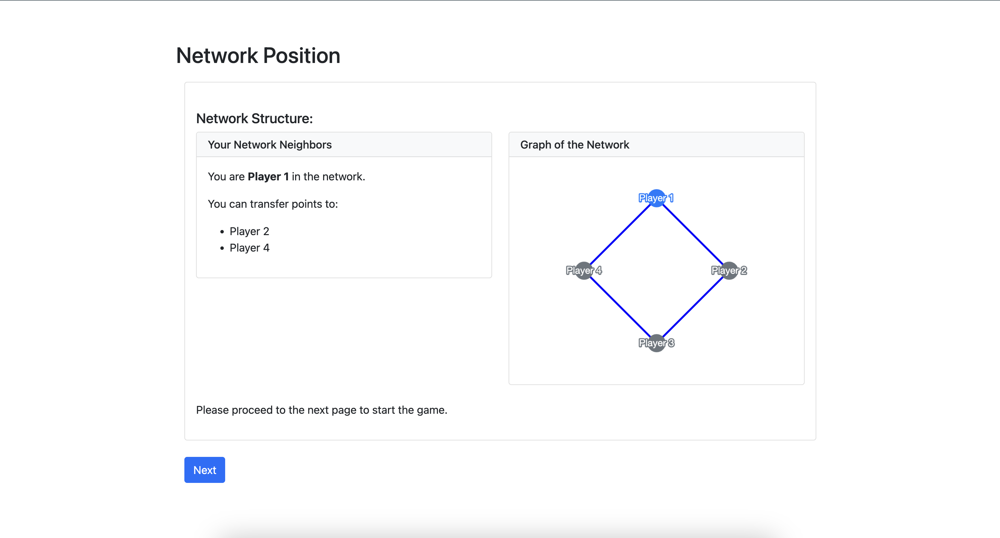
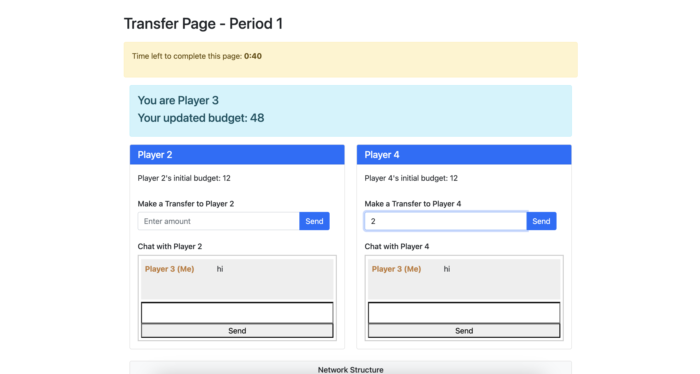
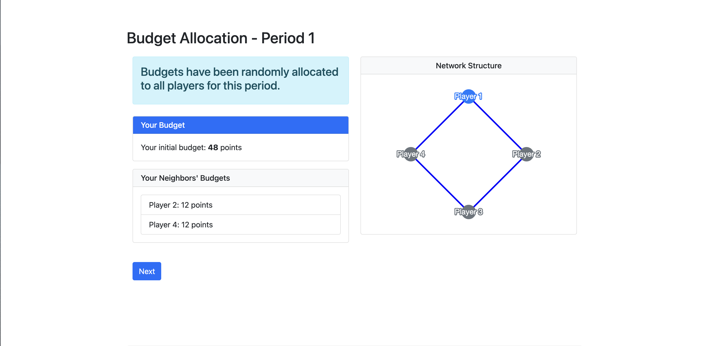
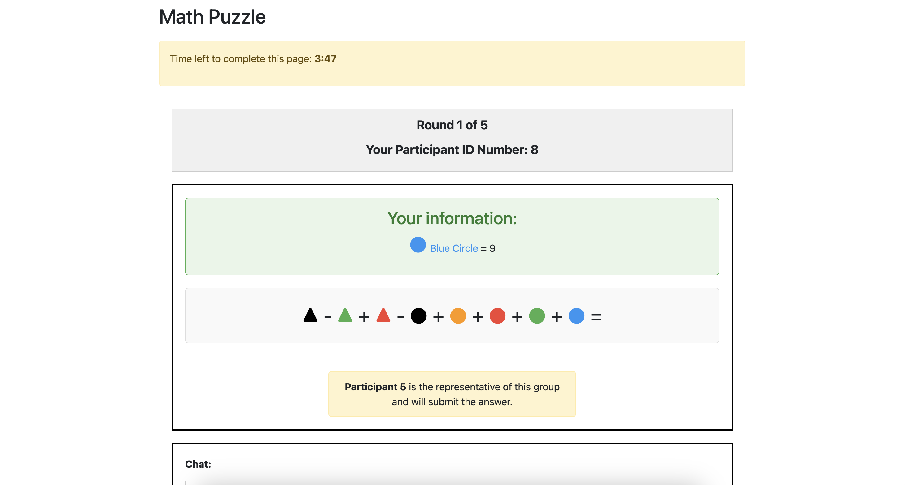
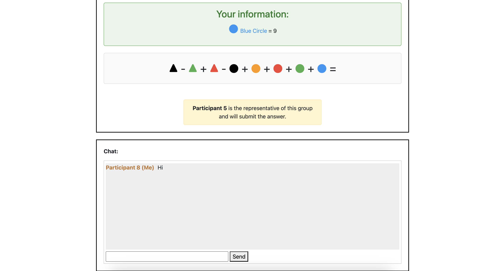
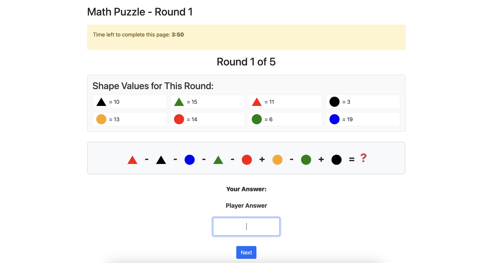

Built and shipped multiple oTree experiment apps modeling strategic interaction (coordination, public-goods, bargaining), with configurable payoff functions and treatment randomization.
Implemented incentive-compatible flows and role-based information structures; synchronized timing and live channels to enforce protocol and minimize signaling, integrating Python backends with custom HTML/CSS/JS interfaces.
Added equilibrium-aware analytics (best-response/Nash benchmarks vs. observed play) with per-round and aggregate payoff exports for reproducible analysis.

<!--more-->
