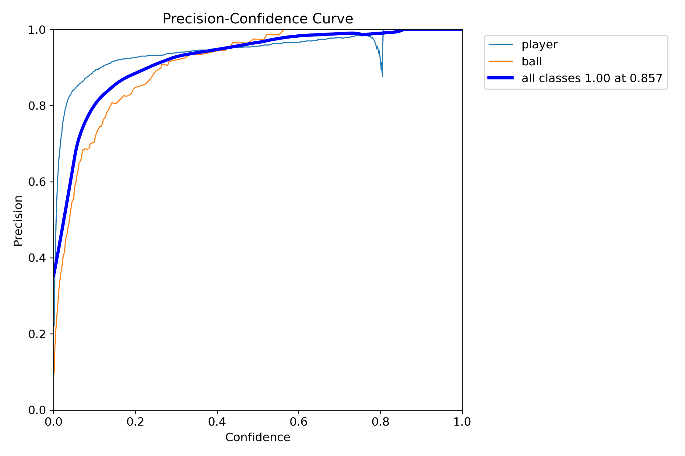

Built an end-to-end WNBA broadcast analytics pipeline (YOLOv8x + small-object settings, tiled/SAHI inference, fixed val_fixed split, fully reproducible runs) — achieved mAP@0.5 = 0.875 overall on validation (player 0.951, ball 0.799).
Scaled labels via a model-assisted loop (predict → YOLO 1.1 export → CVAT correction → re-import), growing the dataset from 5,276→9,280 players (+76%) and 477→853 balls (+79%); the expanded set improved ball mAP@0.5 from 0.781→0.799 while maintaining high precision.
Designed a tracking & evaluation harness to A/B ByteTrack vs. BoT-SORT, selecting by IDF1 with HOTA/MOTA as secondary checks; planned per-shot homography to map detections to 2D court coordinates and a lightweight 1D-CNN/GRU head for shot-type recognition.
Engineered a robust experimental stack: virtual-env isolation (resolving conda/MKL conflicts), deterministic seeds/config logging, MIG/DDP-ready training scripts, and automated result plots (PR, F1-conf, recall-conf, confusion matrices) for fast iteration and auditability.

<!--more-->
